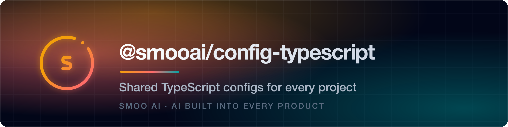

<p align="center">
  <a href="https://smoo.ai"></a>
</p>

<p align="center">
  <a href="https://www.npmjs.com/package/@smooai/config-typescript"></a>
  <a href="https://smoo.ai"></a>
  
</p>

<p align="center">
  
</p>

<p align="center">
  <a href="#-features"><b>Features</b></a> &nbsp;·&nbsp;
  <a href="#-install"><b>Install</b></a> &nbsp;·&nbsp;
  <a href="#-usage"><b>Usage</b></a> &nbsp;·&nbsp;
  <a href="#-part-of-smoo-ai"><b>Platform</b></a>
</p>

---

> A collection of internal TypeScript configurations used across Smoo AI projects. Extend one of these `tsconfig` presets and your project inherits the same strict, modern, monorepo-friendly compiler settings we use everywhere. Derived from `@turbo/config-typescript`.

## ✨ Features

- Standard TypeScript configurations tuned for Smoo AI projects
- Strict type checking enabled by default
- Modern JavaScript feature support
- Consistent settings across every repository
- Optimized for monorepo setups
- Presets available for:
    - Node.js projects
    - React applications
    - Next.js applications
    - Library packages

## 📦 Install

```sh
pnpm add -D @smooai/config-typescript
```

This package has a peer dependency on TypeScript, so make sure it's installed too:

```sh
pnpm add -D typescript
```

## 🚀 Usage

In your `tsconfig.json`:

```json
{
    "extends": "@smooai/config-typescript/base.json"
}
```

Swap `base.json` for the preset that matches your target (Node, React, Next.js, or library).

## 🧩 Part of Smoo AI

`@smooai/config-typescript` is built and open-sourced by **[Smoo AI](https://smoo.ai)** — the AI-powered business platform with AI built into every product: CRM, customer support, campaigns, field service, observability, and developer tools.

- 🧰 **More open source from Smoo AI** — [smoo.ai/open-source](https://smoo.ai/open-source)
- 🧩 **Sibling packages** — [@smooai/config](https://github.com/SmooAI/config), [@smooai/logger](https://github.com/SmooAI/logger), [@smooai/fetch](https://github.com/SmooAI/fetch)

## 🤝 Contributing

Contributions are welcome. This project uses [changesets](https://github.com/changesets/changesets) to manage versions and releases.

1. Fork the repository.
2. Create your branch (`git checkout -b amazing-feature`).
3. Make your changes.
4. Add a changeset to document them: `pnpm changeset` — it prompts for the version bump type (patch, minor, or major) and a description.
5. Commit and push your branch.
6. Open a pull request, referencing any related issues.

The maintainers will review your PR and may request changes before merging.

## 📄 License

MIT © SmooAI. See [LICENSE](LICENSE).

## Contact

Brent Rager

- [Email](mailto:brent@smoo.ai)
- [LinkedIn](https://www.linkedin.com/in/brentrager/)
- [BlueSky](https://bsky.app/profile/brentragertech.bsky.social)
- [TikTok](https://www.tiktok.com/@brentragertech)
- [Instagram](https://www.instagram.com/brentragertech/)

Smoo GitHub: [github.com/SmooAI](https://github.com/SmooAI)

---

<p align="center">
  Built by <a href="https://smoo.ai"><strong>Smoo AI</strong></a> — AI built into every product.
</p>
